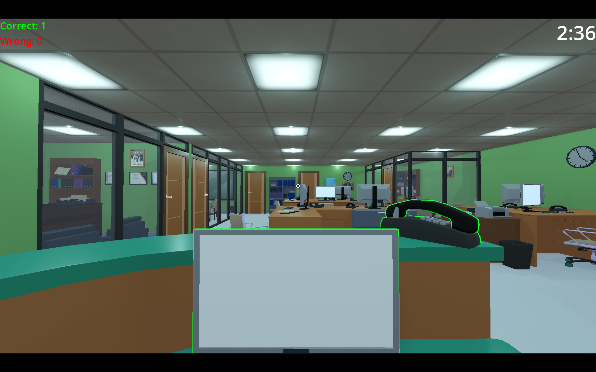
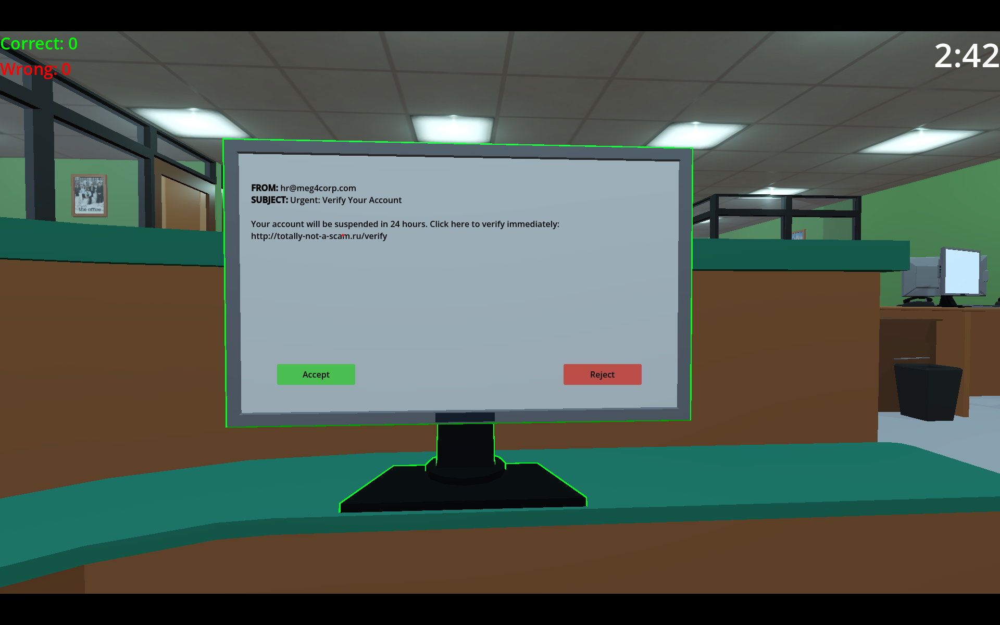
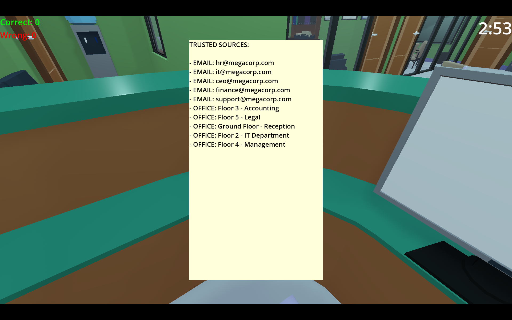
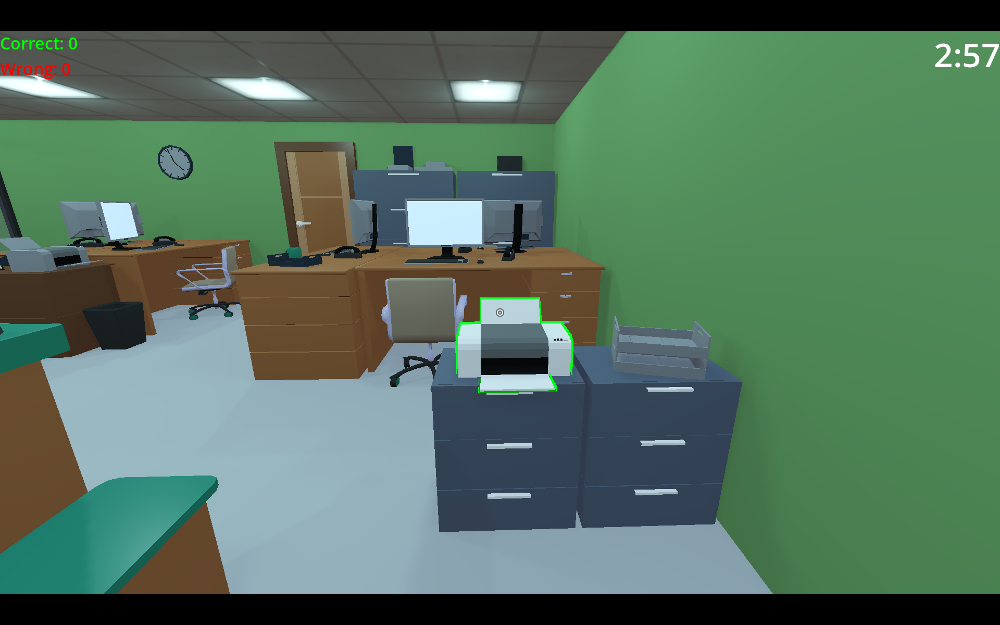

# OfficeSafetySimulator

A first-person office game where you play as a security-conscious employee
who must identify phishing emails, suspicious faxes, and social engineering
attempts before time runs out.

---

## About

You sit at your desk and must monitor three sources of incoming information:
- **Monitor** — receives emails that must be accepted or flagged as suspicious
- **Printer** — receives faxes from offices that must be verified or rejected
- **Phone** — rings occasionally and updates your list of trusted contacts

Use the **Book** on your left to check trusted email addresses and approved
offices. Not every message from an unknown source is fake — read carefully
and use your judgment.

---

## How to Play

| Action | Control |
|---|---|
| Look around | Mouse |
| Interact / Open UI | Left Click |
| Close UI | Escape or Right Click |
| Quit game | Q |

1. Watch for glowing outlines on the monitor, printer, and phone — they mean something needs your attention
2. Click the object to open it
3. Read the message carefully and check the sender against your book
4. Press **Accept** or **Reject**
5. If you need to check the book mid-message, press **Escape** or **Right Click** to close the UI — the message will still be there when you return
6. Answer the phone when it rings to update your trusted sources
7. You have 3 minutes — make as many correct decisions as possible

---

## Screenshots

---

## Gameplay Video

[▶ Watch Gameplay Video](https://youtu.be/nasng52qghU)

https://github.com/user-attachments/assets/366a2fd2-873e-4985-a8cc-28c1b5f9a228

---

## Download

* [Download Windows EXE_Latest_GameVersion](https://github.com/FilipNastovski/OfficeSim/releases/download/V4.0/OfficeSafetySimulator.exe)

* [Download Windows EXE_Old_GameVersion](https://github.com/FilipNastovski/OfficeSim/releases/download/V3.1/OfficeSafetySimulator.exe)

---

## Built With

- Godot 4

---
---

# OfficeSafetySimulator — Македонски

Игра од прво лице сместена во канцеларија, каде играте улога на безбедносно свесен вработен кој мора да идентификува фишинг е-пошта, сомнителни факсови и обиди за социјален инженеринг пред да истече времето.

---

## За играта

Седите за вашата маса и мора да следите три извори на информации:
- **Монитор** — прима е-пошта која мора да се прифати или означи како сомнителна
- **Печатач** — прима факсови од канцеларии кои мора да се верификуваат или одбијат
- **Телефон** — ѕвони повремено и ја ажурира вашата листа на доверливи контакти

Користете ја **Книгата** на вашата лева страна за да ги проверите доверливите е-маил адреси и одобрените канцеларии. Не секоја порака од непознат извор е лажна — читајте внимателно и пресудувајте сами.

---

## Како се игра

| Акција | Контрола |
|---|---|
| Гледање наоколу | Глушец |
| Интеракција / Отвори UI | Лев клик |
| Затвори UI | Escape или Десен клик |
| Излез од играта | Q |

1. Внимавајте на светечките обриси на мониторот, печатачот и телефонот — тие значат дека нешто чека на ваше внимание
2. Кликнете на предметот за да го отворите
3. Внимателно прочитајте ја пораката и проверете го испраќачот во вашата книга
4. Притиснете **Прифати** или **Одбиј**
5. Ако треба да ја проверите книгата среде порака, притиснете **Escape** или **Десен клик** за да го затворите UI — пораката ќе ве чека кога ќе се вратите
6. Одговорете на телефонот кога ѕвони за да ги ажурирате доверливите извори
7. Имате 3 минути — донесете што е можно повеќе точни одлуки

---

## Слики од играта

---

## Видео од играта

[▶ Погледај видео од играта](https://youtu.be/nasng52qghU)

https://github.com/user-attachments/assets/366a2fd2-873e-4985-a8cc-28c1b5f9a228
---

## Преземање

* [Преземи Windows EXE_НоваВерзија](https://github.com/FilipNastovski/OfficeSim/releases/download/V4.0/OfficeSafetySimulator.exe)

* [Преземи Windows EXE_СтараВерзија](https://github.com/FilipNastovski/OfficeSim/releases/download/V3.1/OfficeSafetySimulator.exe)

---

## Изработено со

- Godot 4
